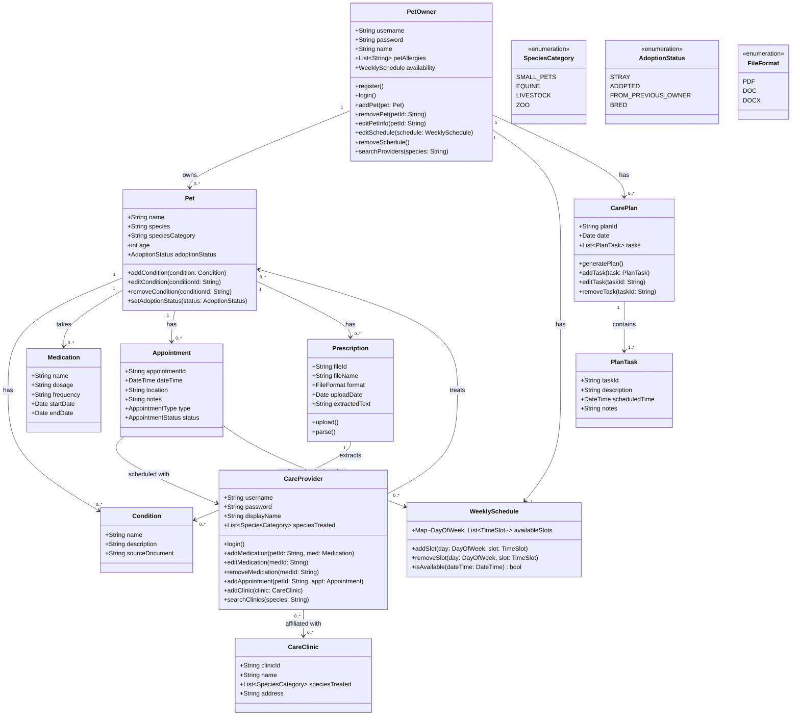

```mermaid
classDiagram

    class PetOwner {
        +String username
        +String password
        +String name
        +List~String~ petAllergies
        +WeeklySchedule availability
        +register()
        +login()
        +addPet(pet: Pet)
        +removePet(petId: String)
        +editPetInfo(petId: String)
        +editSchedule(schedule: WeeklySchedule)
        +removeSchedule()
        +searchProviders(species: String)
    }

    class Pet {
        +String name
        +String species
        +String speciesCategory
        +int age
        +AdoptionStatus adoptionStatus
        +addCondition(condition: Condition)
        +editCondition(conditionId: String)
        +removeCondition(conditionId: String)
        +setAdoptionStatus(status: AdoptionStatus)
    }

    class Condition {
        +String name
        +String description
        +String sourceDocument
    }

    class Medication {
        +String name
        +String dosage
        +String frequency
        +Date startDate
        +Date endDate
    }

    class Appointment {
        +String appointmentId
        +DateTime dateTime
        +String location
        +String notes
        +AppointmentType type
        +AppointmentStatus status
    }

    class Prescription {
        +String fileId
        +String fileName
        +FileFormat format
        +Date uploadDate
        +String extractedText
        +upload()
        +parse()
    }

    class WeeklySchedule {
        +Map~DayOfWeek, List~TimeSlot~~ availableSlots
        +addSlot(day: DayOfWeek, slot: TimeSlot)
        +removeSlot(day: DayOfWeek, slot: TimeSlot)
        +isAvailable(dateTime: DateTime) bool
    }

    class CarePlan {
        +String planId
        +Date date
        +List~PlanTask~ tasks
        +generatePlan()
        +addTask(task: PlanTask)
        +editTask(taskId: String)
        +removeTask(taskId: String)
    }

    class PlanTask {
        +String taskId
        +String description
        +DateTime scheduledTime
        +String notes
    }

    class CareProvider {
        +String username
        +String password
        +String displayName
        +List~SpeciesCategory~ speciesTreated
        +login()
        +addMedication(petId: String, med: Medication)
        +editMedication(medId: String)
        +removeMedication(medId: String)
        +addAppointment(petId: String, appt: Appointment)
        +addClinic(clinic: CareClinic)
        +searchClinics(species: String)
    }

    class CareClinic {
        +String clinicId
        +String name
        +List~SpeciesCategory~ speciesTreated
        +String address
    }

    class SpeciesCategory {
        <<enumeration>>
        SMALL_PETS
        EQUINE
        LIVESTOCK
        ZOO
    }

    class AdoptionStatus {
        <<enumeration>>
        STRAY
        ADOPTED
        FROM_PREVIOUS_OWNER
        BRED
    }

    class FileFormat {
        <<enumeration>>
        PDF
        DOC
        DOCX
    }

    %% Relationships
    PetOwner "1" --> "0..*" Pet : owns
    PetOwner "1" --> "1" WeeklySchedule : has
    PetOwner "1" --> "0..*" CarePlan : has

    Pet "1" --> "0..*" Condition : has
    Pet "1" --> "0..*" Medication : takes
    Pet "1" --> "0..*" Appointment : has
    Pet "1" --> "0..*" Prescription : has

    Prescription "1" --> "0..*" Condition : extracts

    CarePlan "1" --> "1..*" PlanTask : contains

    CareProvider "0..*" --> "0..*" Pet : treats
    CareProvider "0..*" --> "0..*" CareClinic : affiliated with

    Appointment --> CareProvider : scheduled with
    Appointment --> WeeklySchedule : conflicts checked against
```
