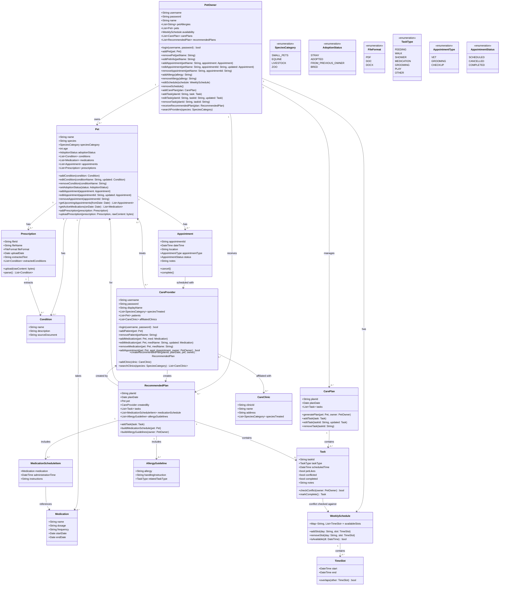

```mermaid
classDiagram

    class PetOwner {
        +String username
        +String password
        +String name
        +List~String~ petAllergies
        +List~Pet~ pets
        +WeeklySchedule availability
        +List~CarePlan~ carePlans
        +List~RecommendedPlan~ recommendedPlans
        +login(username, password) bool
        +addPet(pet: Pet)
        +removePet(petName: String)
        +editPetInfo(petName: String)
        +addAppointment(petName: String, appointment: Appointment)
        +editAppointment(petName: String, appointmentId: String, updated: Appointment)
        +removeAppointment(petName: String, appointmentId: String)
        +addAllergy(allergy: String)
        +removeAllergy(allergy: String)
        +editSchedule(schedule: WeeklySchedule)
        +removeSchedule()
        +addCarePlan(plan: CarePlan)
        +addTask(planId: String, task: Task)
        +editTask(planId: String, taskId: String, updated: Task)
        +removeTask(planId: String, taskId: String)
        +receiveRecommendedPlan(plan: RecommendedPlan)
        +searchProviders(species: SpeciesCategory)
    }

    class Pet {
        +String name
        +String species
        +SpeciesCategory speciesCategory
        +int age
        +AdoptionStatus adoptionStatus
        +List~Condition~ conditions
        +List~Medication~ medications
        +List~Appointment~ appointments
        +List~Prescription~ prescriptions
        +addCondition(condition: Condition)
        +editCondition(conditionName: String, updated: Condition)
        +removeCondition(conditionName: String)
        +setAdoptionStatus(status: AdoptionStatus)
        +addAppointment(appointment: Appointment)
        +editAppointment(appointmentId: String, updated: Appointment)
        +removeAppointment(appointmentId: String)
        +getUpcomingAppointments(fromDate: Date) List~Appointment~
        +getActiveMedications(onDate: Date) List~Medication~
        +addPrescription(prescription: Prescription)
        +uploadPrescription(prescription: Prescription, rawContent: bytes)
    }

    class Task {
        +String taskId
        +TaskType taskType
        +DateTime scheduledTime
        +bool petLikes
        +bool conflicted
        +bool completed
        +String notes
        +checkConflict(owner: PetOwner) bool
        +markComplete() Task
    }

    class CarePlan {
        +String planId
        +Date planDate
        +List~Task~ tasks
        +generatePlan(pet: Pet, owner: PetOwner)
        +addTask(task: Task)
        +editTask(taskId: String, updated: Task)
        +removeTask(taskId: String)
    }

    class RecommendedPlan {
        +String planId
        +Date planDate
        +Pet pet
        +CareProvider createdBy
        +List~Task~ tasks
        +List~MedicationScheduleItem~ medicationSchedule
        +List~AllergyGuideline~ allergyGuidelines
        +addTask(task: Task)
        +buildMedicationSchedule(pet: Pet)
        +buildAllergyGuidelines(owner: PetOwner)
    }

    class MedicationScheduleItem {
        +Medication medication
        +DateTime administrationTime
        +String instructions
    }

    class AllergyGuideline {
        +String allergy
        +String handlingInstruction
        +TaskType relatedTaskType
    }

    class Condition {
        +String name
        +String description
        +String sourceDocument
    }

    class Medication {
        +String name
        +String dosage
        +String frequency
        +Date startDate
        +Date endDate
    }

    class Appointment {
        +String appointmentId
        +DateTime dateTime
        +String location
        +AppointmentType appointmentType
        +AppointmentStatus status
        +String notes
        +cancel()
        +complete()
    }

    class Prescription {
        +String fileId
        +String fileName
        +FileFormat fileFormat
        +Date uploadDate
        +String extractedText
        +List~Condition~ extractedConditions
        +upload(rawContent: bytes)
        +parse() List~Condition~
    }

    class WeeklySchedule {
        +Map~String, List~TimeSlot~~ availableSlots
        +addSlot(day: String, slot: TimeSlot)
        +removeSlot(day: String, slot: TimeSlot)
        +isAvailable(dt: DateTime) bool
    }

    class TimeSlot {
        +DateTime start
        +DateTime end
        +overlaps(other: TimeSlot) bool
    }

    class CareProvider {
        +String username
        +String password
        +String displayName
        +List~SpeciesCategory~ speciesTreated
        +List~Pet~ patients
        +List~CareClinic~ affiliatedClinics
        +login(username, password) bool
        +addPatient(pet: Pet)
        +removePatient(petName: String)
        +addMedication(pet: Pet, med: Medication)
        +editMedication(pet: Pet, medName: String, updated: Medication)
        +removeMedication(pet: Pet, medName: String)
        +addAppointment(pet: Pet, appt: Appointment, owner: PetOwner) bool
        +createRecommendedPlan(planId, planDate, pet, owner) RecommendedPlan
        +addClinic(clinic: CareClinic)
        +searchClinics(species: SpeciesCategory) List~CareClinic~
    }

    class CareClinic {
        +String clinicId
        +String name
        +String address
        +List~SpeciesCategory~ speciesTreated
    }

    class SpeciesCategory {
        <<enumeration>>
        SMALL_PETS
        EQUINE
        LIVESTOCK
        ZOO
    }

    class AdoptionStatus {
        <<enumeration>>
        STRAY
        ADOPTED
        FROM_PREVIOUS_OWNER
        BRED
    }

    class FileFormat {
        <<enumeration>>
        PDF
        DOC
        DOCX
    }

    class TaskType {
        <<enumeration>>
        FEEDING
        WALK
        SHOWER
        MEDICATION
        GROOMING
        PLAY
        OTHER
    }

    class AppointmentType {
        <<enumeration>>
        VET
        GROOMING
        CHECKUP
    }

    class AppointmentStatus {
        <<enumeration>>
        SCHEDULED
        CANCELLED
        COMPLETED
    }

    %% Relationships
    PetOwner "1" --> "0..*" Pet : owns
    PetOwner "1" --> "1" WeeklySchedule : has
    PetOwner "1" --> "0..*" CarePlan : manages
    PetOwner "1" --> "0..*" RecommendedPlan : receives

    Pet "1" --> "0..*" Condition : has
    Pet "1" --> "0..*" Medication : takes
    Pet "1" --> "0..*" Appointment : has
    Pet "1" --> "0..*" Prescription : has

    Prescription "1" --> "0..*" Condition : extracts

    CarePlan "1" --> "0..*" Task : contains
    Task --> WeeklySchedule : conflict checked against
    WeeklySchedule "1" --> "0..*" TimeSlot : contains

    RecommendedPlan "1" --> "0..*" Task : contains
    RecommendedPlan "1" --> "0..*" MedicationScheduleItem : includes
    RecommendedPlan "1" --> "0..*" AllergyGuideline : includes
    RecommendedPlan --> Pet : for
    RecommendedPlan --> CareProvider : created by

    MedicationScheduleItem --> Medication : references

    CareProvider "0..*" --> "0..*" Pet : treats
    CareProvider "0..*" --> "0..*" CareClinic : affiliated with
    CareProvider --> RecommendedPlan : creates

    Appointment --> CareProvider : scheduled with
```
